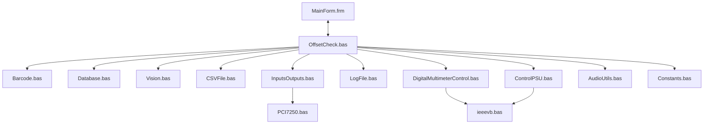

# Offset Rig Software - Translation Guide

This document serves as a guide for migrating the post-calibration Offset Rig software from twinBASIC / Visual Basic 6 to a modern language and framework (e.g., C# / .NET, Python, or C++).

## System Architecture

The codebase is structured around a central form (`MainForm.frm`) that acts as both the UI and a data/state container, coupled with several utility and control modules:



---

## Recommended Module Mapping

When migrating to the target environment, the following structural partition is recommended:

| VB Module | Proposed Target Module/Class | Purpose | Key COM/Win32 APIs to Replace |
| --- | --- | --- | --- |
| `OffsetCheck.bas` | `TestOrchestrator` / `StateRunner` | Main business logic, limits checks, and test runner | None (decouple from UI controls) |
| `Constants.bas` | `Configuration` / `AppConstants` | Voltage, resistance, timing, and batch limits | Move magic numbers to JSON config if possible |
| `LogFile.bas` | `Logger` + `ConfigurationLoader` | Logging text outputs, loading configuration text files | Replace custom text parsing with YAML/JSON configs |
| `Database.bas` | `DatabaseAccess` / SQLite Repo | Query database for limits and settings | Replace ADODB with native SQLite library (e.g., `Microsoft.Data.Sqlite` or `sqlite3` in Python) |
| `Barcode.bas` | `BarcodeParser` | Extracts values (e.g. part number, span) from serial scans | Replace `InStr`/`Mid` with Regular Expressions (Regex) |
| `CSVFile.bas` | `ResultsExporter` / `LabelPrinter` | Formats Excel output sheets, launches labels script | Replace Excel COM Automation with native openpyxl/pandas or ClosedXML/EPPlus |
| `Vision.bas` | `CameraService` | Checks O-rings and restrictors via RS-232 serial | Replace `MSComm` control with `System.IO.Ports.SerialPort` or `pyserial` |
| `InputsOutputs.bas` | `HardwareController` | Digital output control (relays, interlocks) | Replace `PCI7250.bas` P/Invokes with ADLINK .NET SDK |
| `DigitalMultimeterControl.bas` | `MultimeterDevice` / `SwitchMatrix` | Controls DMM readings and Switch Matrix paths over GPIB | Replace direct GPIB command strings with VISA API wrapper (NI-VISA, PyVISA) |
| `ControlPSU.bas` | `PowerSupplyDevice` | Initialises and drives programmable Keithley PSU | Replace IVI COM automation with VISA or IVI .NET driver |
| `AudioUtils.bas` | `SoundService` | Plays pass/fail chime wave sounds | Replace Win32 `PlaySound` call with `winsound`/`pygame` or `SoundPlayer` |

---

## State and UI Decoupling

A major restructuring challenge is that `OffsetCheck.bas` directly queries and updates UI control properties on `MainForm` (e.g., `MainForm.VOUT1PASS.Visible = True`, `MainForm.SensorID`, `MainForm.FirstMCSBarcode`). 

### Recommendations
1. **Data Model**: Create a `TestState` class that contains properties such as `SensorID`, `FirstBarcode`, `SecondBarcode`, `ThirdBarcode`, `Vout1Reading`, `Vout2Reading`, and `Status`.
2. **Data Binding / Events**: Make the UI push scanned barcodes to the `TestState` object, and have the `TestOrchestrator` update the state. The UI should subscribe to changes in the state object (e.g. via INotifyPropertyChanged in C# or event bindings) to toggle visibility of pass/fail images or text.

---

## Hardware and Driver Migration

### 1. Keithley Digital Multimeter & Switch Matrix (GPIB)
- **VB Implementation**: Communicates using capital equipment card wrappers (`ieeevb.bas`) sending ASCII command strings (e.g., `":ROUT:OPEN:ALL"`, `":MEAS:VOLT:DC?"`).
- **Target Implementation**: Keep the SCPI command strings but route them via a standard VISA implementation (e.g., **NI-VISA** or **PyVISA**), which abstracts whether connection is over GPIB, USB, or Ethernet.

### 2. Keithley Power Supply (IVI Driver COM)
- **VB Implementation**: Declares `Dim Driver As New Keithley2230` using COM.
- **Target Implementation**: Most modern target environments support the IVI driver standard directly via C/C++ DLLs, .NET assemblies, or you can control it using raw SCPI commands over VISA/USB serial interfaces.

### 3. ADLINK PCI-7250 (I/O Card)
- **VB Implementation**: Directly invokes `Register_Card`, `DO_WritePort`, and `DI_ReadPort` from `Pci-Dask.dll` (`PCI7250.bas`).
- **Target Implementation**: Utilize the official ADLINK SDK for your target language (e.g. ADLINK DASK .NET component or the C-library wrappers).

### 4. Serial Port Camera / Vision (ActiveX MSComm)
- **VB Implementation**: Uses MSComm OCX to transmit commands (e.g., `"PW,1,35"` to change camera programs) and retrieve outputs.
- **Target Implementation**: Use standard serial port libraries built into your language framework.

---

## Critical Logic Highlights

### Batch Boundary Calculation (`FindOffset` / `GetBatchInfo`)
The offset logic reads a historical calibration span from a CSV file. The file is split into batches based on the rig type (batch sizes are 40, 42, or 14).
The batch index is computed mathematically:
```python
# Python equivalent:
batch_index = (sensor_id - 1) // batch_size
id_start = batch_index * batch_size
batch_number = f"{id_start + 1:03d}"
```

### Password Verification & Database Reset
- **Factory password**: `"sens666"`
- When the cable usage limit warning is triggered or manually reset, the SQLite database table `cable_harness` must be updated to reset usage:
```sql
UPDATE cable_harness SET current_usage = 0 WHERE channel_number = ?
```
